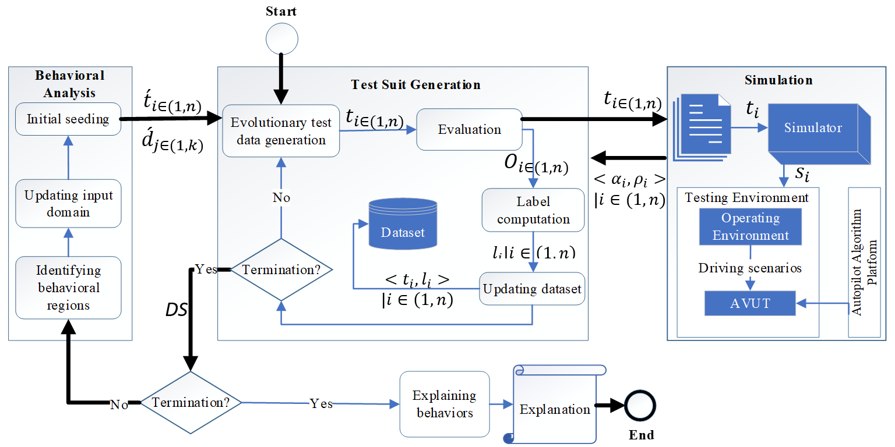
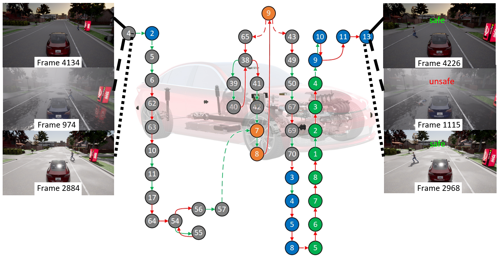
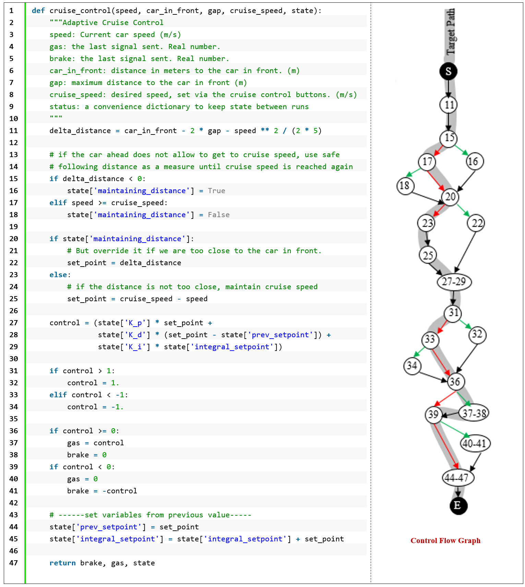
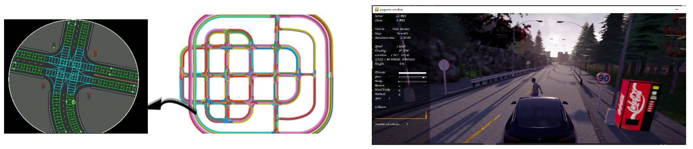
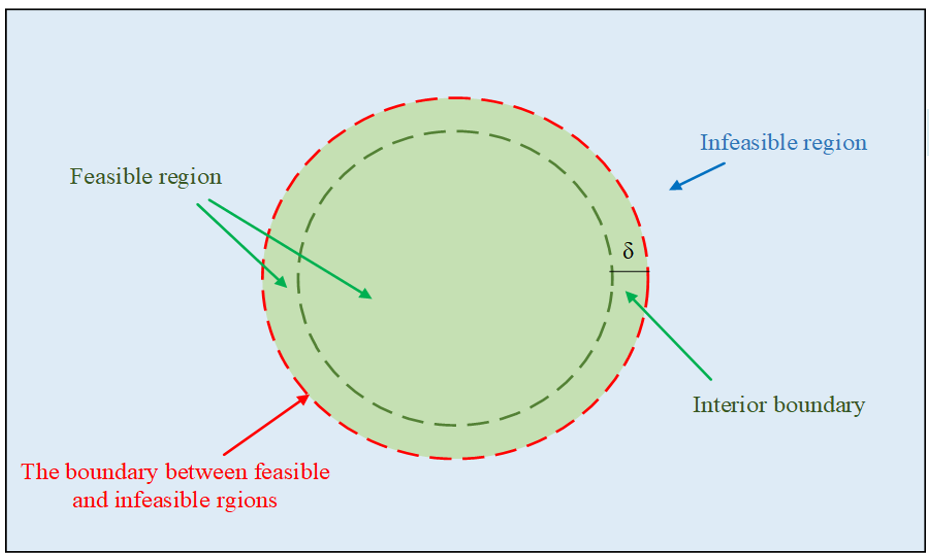
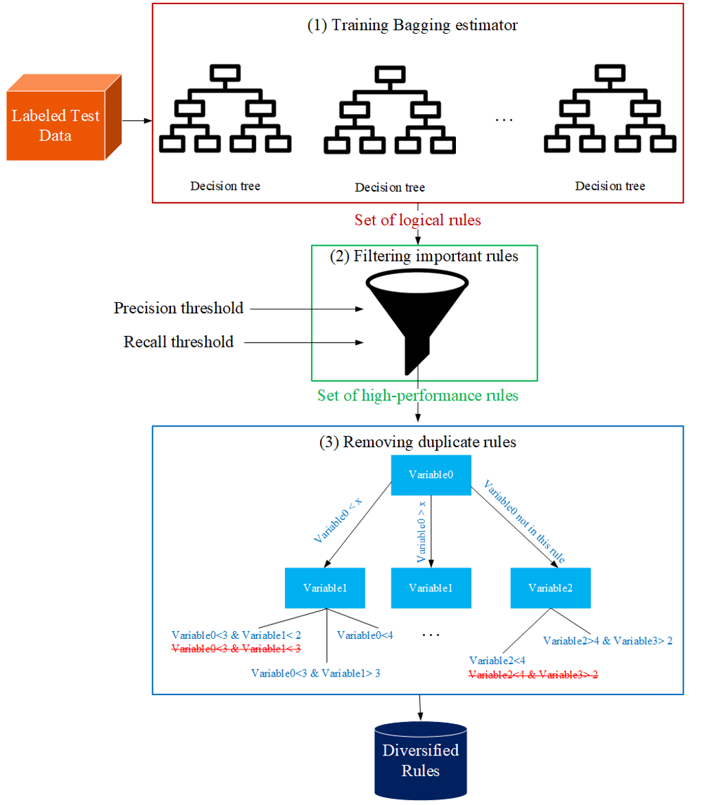
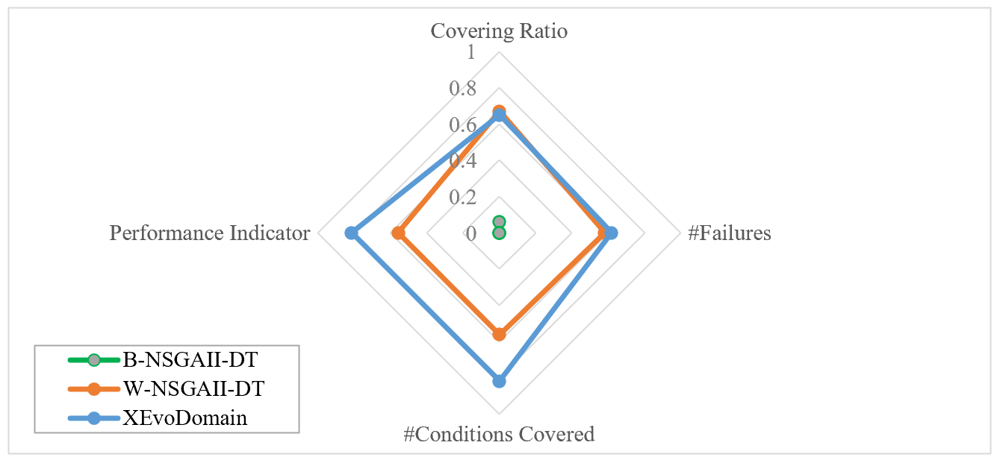
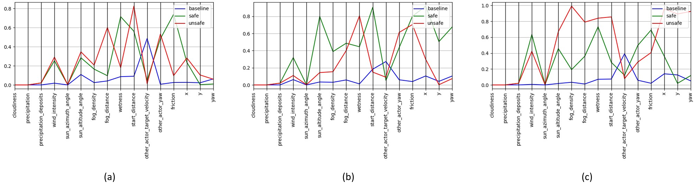

# XEvoDomain

### Learning-Guided White-Box Test Generation for Autonomous Driving Systems

XEvoDomain is a **learning-guided, multi-objective test generation framework** for autonomous driving systems with rule-based decision-making components.

The framework combines **critical execution paths**, **behavioral-region learning**, and **white-box information from the system under test** to generate test scenarios that target critical behavioral regions and expose undesirable system behavior.

XEvoDomain was developed for simulation-based testing of autonomous driving systems using the **CARLA simulator**.

<p align="center">
  
  <br>
  <em>Overview of the XEvoDomain framework.</em>
</p>

---

## 🎯 Key Contributions

### 1. Behavior-Oriented Test Requirements

XEvoDomain identifies test requirements based on **critical execution paths**. Paths involving substantial interaction with the environment provide targeted requirements for system-level behavioral testing.

### 2. Critical-Path Boundary Coverage

The framework introduces a boundary-oriented criterion to assess how effectively generated tests explore the input domain associated with a target critical execution path.

### 3. Learning-Guided Multi-Objective Search

XEvoDomain combines behavioral-region learning with **NSGA-II** to progressively guide evolutionary search toward critical and failure-prone regions.

### 4. White-Box Behavioral Guidance

Rather than relying only on observable input/output behavior, XEvoDomain exploits internal execution information, including critical execution paths, to provide more targeted search guidance.

### 5. Ensemble Rule Learning

The framework uses multiple rule-learning models to characterize behavioral regions and support subsequent search iterations.

---

## 🔬 Testing Approach

The overall testing process can be summarized as:

```text
Initial Test Population
          ↓
   CARLA Simulation
          ↓
   Behavior Collection
          ↓
 Behavioral-Region Learning
          ↓
 Multi-Objective Evolutionary Search
          ↓
  New Test Scenarios
          ↓
     More Simulation
          ↓
Failure Characterization
          ↓
    Rule Extraction
```

The process is **incremental**: knowledge obtained from previously generated tests is incorporated into subsequent search iterations, progressively directing the search toward critical behavioral regions.

---

## 🧩 Critical Execution Paths

XEvoDomain uses white-box information from the autonomous driving system to identify execution paths that contain substantial interaction with the environment.

A **critical execution path** represents a sequence of program interactions through which the system responds to its environment. Different environmental conditions may produce different outcomes even when they exercise the same internal execution path.

<p align="center">
  
  <br>
  <em>Two dynamic-object crossing scenarios that produce different outcomes while covering the same execution path in the CARLA simulator. Colored nodes indicate branch points in different system components, while green and red edges represent True and False branches, respectively.</em>
</p>

The selected critical paths become **behavioral test requirements** for the evolutionary search. XEvoDomain searches for input conditions that exercise these paths while exposing differences and undesirable behaviors in the system.

### A Concrete Example from the Source Code

The following example illustrates how a critical execution path can be analyzed from the source code and its control-flow structure.

<p align="center">
  
  <br>
  <em>Example of critical-path analysis based on the control-flow graph of the <code>cruise_control</code> function.</em>
</p>

This connection between **source-code structure, execution paths, and environmental interactions** provides the white-box guidance used during test generation.

---

## 🚗 CARLA Testing Environment

XEvoDomain uses the **CARLA simulator** to execute generated test scenarios and observe the behavior of the autonomous driving system.

The experiments use predefined roads and dynamic-object scenarios to expose the system to different environmental conditions.

<p align="center">
  
  <br>
  <em>Example experimental environment in CARLA: (a) Town5 map with a selected road segment and (b) a dynamic-object crossing scenario.</em>
</p>

---

## 🗺️ Behavioral Search Space

For each target critical path, XEvoDomain searches for input conditions that exercise the path and expose undesirable behavior.

The input domain associated with a target path partitions the search space and provides a behavior-oriented target for test generation.

<p align="center">
  
  <br>
  <em>Illustration of search-space partitioning according to the input domain of a target critical path.</em>
</p>

The evolutionary search considers multiple objectives to generate effective test scenarios, including proximity to undesirable behavior, critical-path exploration, and behavioral diversity.

---

## 🧠 Learning Behavioral Regions

The failure pattern of a decision-making component can be complex and difficult to describe explicitly.

XEvoDomain therefore uses machine-learning models to identify **behavioral regions** during the testing process.

A behavioral region represents a set of input conditions associated with a particular system behavior.

The search proceeds iteratively:

1. Generate an initial set of test scenarios.
2. Execute the scenarios in CARLA.
3. Collect input, execution, and behavioral information.
4. Learn behavioral regions from the accumulated test data.
5. Use the learned regions to guide the next search iteration.
6. Generate and execute new test scenarios.
7. Update the behavioral knowledge with the new observations.

This feedback loop progressively directs the search toward regions that are more relevant to undesirable behavior.

---

## 📐 Rule Extraction

After the learning-guided search, the accumulated test data is used to extract interpretable rules describing the identified behavioral regions.

<p align="center">
  
  <br>
  <em>Illustration of behavioral-rule extraction from the accumulated test data.</em>
</p>

The extracted rules provide an interpretable description of the conditions associated with particular system behaviors and can be used to characterize critical or failure-prone regions.

---

## 📊 Experimental Evaluation

XEvoDomain was evaluated on an autonomous driving system with a rule-based decision-making component using the CARLA simulator.

The evaluation considers:

* **Behavioral-region identification**
* **Failure detection**
* **Behavioral-boundary detection**
* **Multi-objective search effectiveness**
* **Behavioral diversity**
* **Rule consistency**

### Behavioral-Region Identification

The effectiveness of selected test-generation approaches was compared in identifying behavioral regions.

<p align="center">
  
  <br>
  <em>Comparison of selected approaches in identifying behavioral regions.</em>
</p>

### Behavioral Boundaries

The experiments also evaluate how effectively different approaches identify boundaries between behavioral regions.

<p align="center">
  
  <br>
  <em>Examples of behavioral boundaries generated by BBT, XEvoDomain (Ensemble), and XEvoDomain (DT) for the CARLA system.</em>
</p>

The parallel-coordinate plots show the normalized input variables associated with the identified behavioral boundaries.

---

## 🔎 Research Findings

The experimental results demonstrate the value of incorporating **white-box information** into system-level test generation.

The evaluation indicates that:

* Critical execution paths provide targeted guidance for behavioral exploration.
* Learning behavioral regions during the search supports exploration of critical areas.
* Ensemble rule learning can provide broader behavioral exploration than a single rule-learning model.
* XEvoDomain outperforms the evaluated baseline approaches on several behavioral-region and boundary-related measures.
* The behavioral rules identified by XEvoDomain are consistent with those obtained by the evaluated black-box approach while benefiting from additional internal execution information.

---

## ⚙️ Installation

### System Requirements

The original implementation was developed and evaluated using:

* **Operating System:** Windows
* **Python:** 3.7
* **CARLA:** 0.9.9
* **Scenario Runner:** 0.9.8

> The repository reflects the environment used for the original experiments. Newer versions of Python, CARLA, or Scenario Runner may require compatibility adjustments.

### 1. Install CARLA

Install **CARLA 0.9.9** and extract it to a location of your choice.

### 2. Configure the CARLA Python API

The repository contains the Python API used by the experiments.

Replace the default `PythonAPI` directory in your CARLA installation with the compatible version provided in this repository:

```text
<repository>/CARLA_0.9.9/PythonAPI
        ↓
<your CARLA installation>/PythonAPI
```

This step ensures compatibility between XEvoDomain and the CARLA version used in the experiments.

### 3. Create the Python Environment

Using Anaconda:

```bash
conda create -n xevodomain_env python=3.7
conda activate xevodomain_env
```

### 4. Install Dependencies

From the repository root:

```bash
pip install -r requirements.txt
```

---

## ▶️ Running XEvoDomain

Make sure the CARLA simulator is running before starting the framework.

From the repository root, run:

```bash
python scenario-runner/explorer.py
```

---

## 📂 Repository Structure

The project files are organized directly at the repository root:

```text
XEvoDomain/
│
├── configs/
├── CARLA_0.9.9/
├── scenario-runner/
├── leaderboard/
├── dataset/
├── roads/
├── tools/
│
├── docs/
│   └── images/
│       ├── xevodomain-overview.png
│       ├── critical-execution-path.png
│       ├── cruise-control-cfg.png
│       ├── carla-critical-scenario.png
│       ├── search-space-partitioning.png
│       ├── rule-extraction.png
│       ├── behavioral-region-comparison.png
│       └── behavioral-boundaries-comparison.png
│
├── requirements.txt
├── README.md
└── LICENSE
```

The project does **not require a `src/` directory**. Components are organized directly under the repository root.

---

## 📤 Outputs

During execution, XEvoDomain produces test scenarios, simulation results, behavioral information, and rule-learning outputs.

Typical outputs include:

* Generated test scenarios
* Simulation logs
* Execution traces
* Behavioral-region information
* Failure-model data
* Extracted behavioral rules
* Search and evaluation metrics

The exact output location depends on the configuration used for the experiment.

---

## 🛠️ Troubleshooting

### CARLA Does Not Start or Connect

Make sure that:

* CARLA 0.9.9 is running.
* The correct CARLA server instance is being used.
* No previous CARLA process is interfering with the connection.

Restart CARLA if necessary.

### PythonAPI Errors

Verify that the Python API from this repository is compatible with **CARLA 0.9.9** and that the required `PythonAPI` files have been installed correctly.

### Missing Dependencies

Reinstall the required packages:

```bash
pip install -r requirements.txt
```

### Scenario Runner Issues

Make sure that **Scenario Runner 0.9.8** is used with **CARLA 0.9.9**.

Mixing incompatible versions can result in import errors or simulator-connection problems.

---

## 📚 Additional Experimental Material

Additional experimental figures and tables are provided in the [`docs/`](docs/) directory.

These materials include:

* Selected critical execution paths
* Repeated I/O calls along critical paths
* Behavioral-region comparisons
* Extracted rules for critical behavioral regions
* Distribution of boundary scenario pairs
* Boundary-detection comparisons

---

## 🔬 Research Context

XEvoDomain was developed as part of Ph.D. research on:

**Domain Analysis and Its Effect on Improving Testability and Explainability of Learning-based Cyber-Physical Systems**

The framework represents the system-level testing approach developed for systems with **rule-based decision-making components**.

The research investigates how internal execution information and learned behavioral knowledge can be combined with evolutionary search to improve the effectiveness of testing complex autonomous systems.

The dissertation contains additional technical details, mathematical formulations, experimental settings, figures, tables, and analyses.

---

## 📄 Citation

A research article describing XEvoDomain is currently under preparation.

If you use this artifact in your research, please refer to the repository and the associated Ph.D. research.

---

## License

This project is released under the license specified in [`LICENSE`](LICENSE).

---

## Author

**Akram Kalaee**
Ph.D. in Software Engineering
Iran University of Science and Technology
